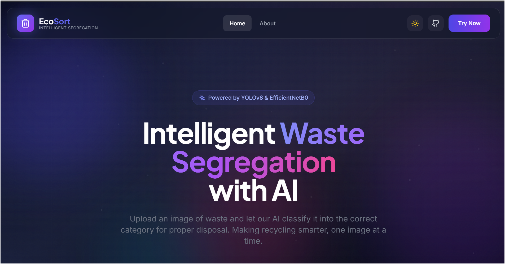
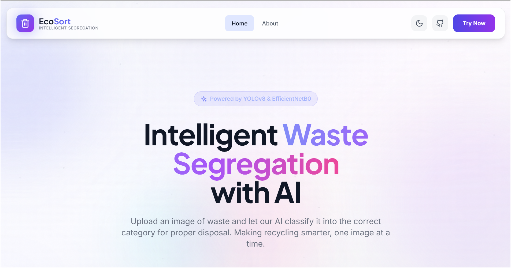
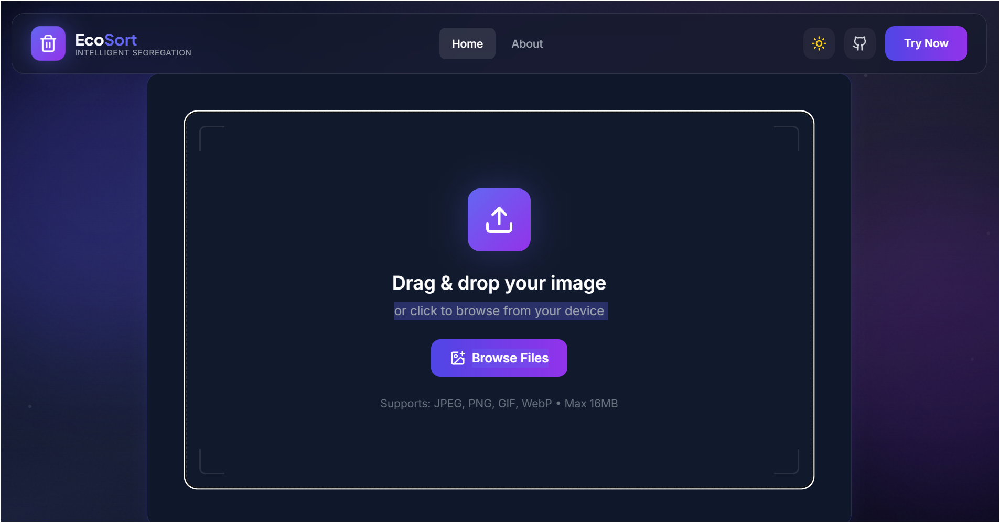
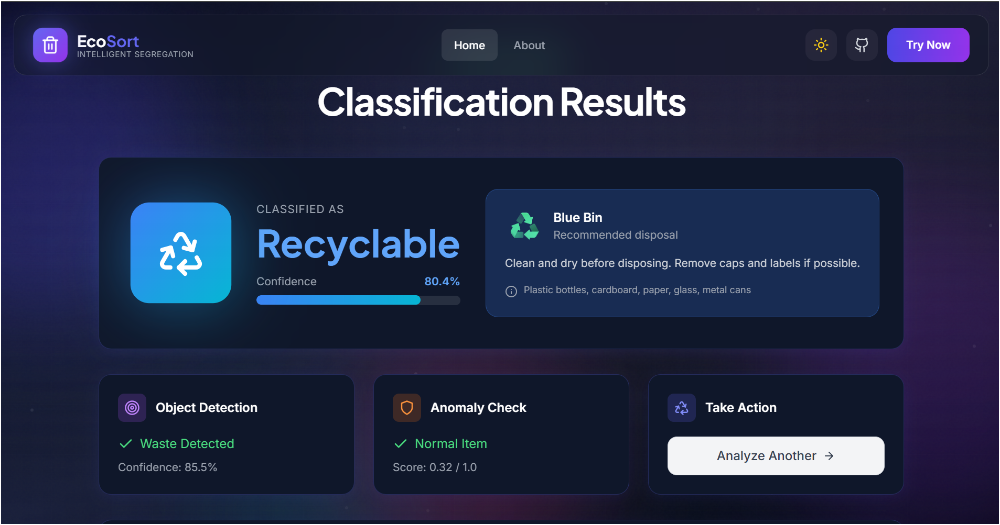
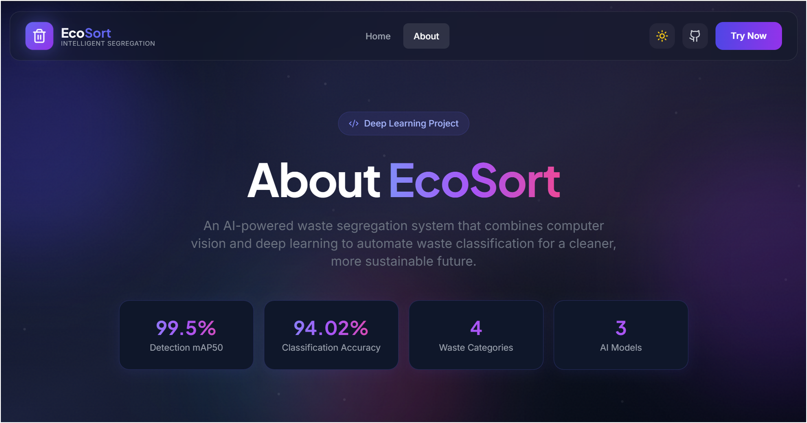

# 🗑️ Intelligent Waste Segregation System

An AI-powered waste detection and classification system using deep learning and computer vision to automate waste segregation from images. Features a modern React frontend with real-time classification and beautiful visualizations.


## � Screenshots

<div align="center">

### 🌙 Dark Mode


### ☀️ Light Mode


### 📤 Upload Zone


### 📊 Classification Results


### ℹ️ About Page


</div>

## �📋 Overview

This system combines three powerful deep learning models into a unified pipeline:

| Model | Purpose | Accuracy |
|-------|---------|----------|
| **YOLOv8 Nano** | Object Detection | mAP50: 99.5% |
| **EfficientNetB0** | 4-Class Classification | 94.02% |
| **Autoencoder** | Anomaly Detection | Threshold-based |

### Waste Categories
- ♻️ **Recyclable** - Plastic, glass, metal, paper
- 🟢 **Organic** - Food waste, yard waste
- 🔴 **E-waste** - Electronics, batteries
- ⚫ **General** - Non-recyclable waste

## 🌐 Web Application

The project includes a full-stack web application:

- **Frontend**: React 18 + Vite + Tailwind CSS + Framer Motion
- **Backend**: Flask REST API

### Features
- 🎨 Modern glass morphism UI with animated backgrounds
- 📤 Drag-and-drop image upload with preview
- 📊 Real-time classification with confidence scores
- 📱 Fully responsive design
- ⚡ Fast inference with optimized models

### Running the Web App

1. **Start the Flask backend**
   ```bash
   python app.py
   ```

2. **Start the React frontend**
   ```bash
   cd frontend
   npm install
   npm run dev
   ```

3. Open http://localhost:3000 in your browser

## 🏗️ Project Structure

```
WasteSegregation/
├── app.py                       # Flask backend API
├── frontend/                    # React frontend
│   ├── src/
│   │   ├── components/          # React components
│   │   ├── App.jsx              # Main app
│   │   └── index.css            # Tailwind styles
│   ├── package.json
│   └── vite.config.js
├── templates/                   # Flask HTML templates
├── static/                      # Static assets
├── config/
│   ├── config.yaml              # Project configuration
│   └── dataset.yaml             # YOLO dataset config
├── models/
│   ├── yolo/
│   │   └── waste_detector_best.pt    # YOLO detector weights
│   ├── mobilenet/
│   │   ├── waste_classifier_final.keras
│   │   ├── waste_classifier_final.h5
│   │   └── class_mapping.yaml
│   └── autoencoder/
│       ├── autoencoder_final.keras
│       └── anomaly_config.yaml
├── notebooks/
│   ├── 01_environment_setup.ipynb    # Environment setup
│   ├── 02_data_preparation.ipynb     # Data processing
│   ├── 03_yolo_training.ipynb        # YOLO training
│   ├── 04_mobilenet_classification.ipynb  # MobileNet training
│   ├── 05_autoencoder_anomaly.ipynb  # Anomaly detector
│   ├── 06_integration_pipeline.ipynb # Full pipeline
│   ├── 07_taco_integration.ipynb     # TACO dataset
│   ├── 08_improve_dataset.ipynb      # Dataset balancing
│   └── 09_efficientnet_training.ipynb # EfficientNetB0 (94.02%)
├── src/
│   ├── __init__.py
│   ├── detector.py              # YOLO detection module
│   ├── classifier.py            # MobileNet classifier
│   ├── anomaly_detector.py      # Autoencoder anomaly
│   ├── pipeline.py              # Unified pipeline
│   └── utils/
│       ├── __init__.py
│       └── helpers.py
├── requirements.txt
├── LICENSE
└── README.md
```

## 🚀 Getting Started

### Prerequisites

- Python 3.8+
- pip package manager

### Installation

1. **Clone the repository**
   ```bash
   git clone https://github.com/Aniketkoppaka/WasteSegregation.git
   cd WasteSegregation
   ```

2. **Create virtual environment**
   ```bash
   python -m venv .venv
   
   # Windows
   .venv\Scripts\activate
   
   # Linux/Mac
   source .venv/bin/activate
   ```

3. **Install dependencies**
   ```bash
   pip install -r requirements.txt
   ```

4. **Download datasets** (Optional - for training)
   - [TrashNet Dataset](https://github.com/garythung/trashnet)
   - [TACO Dataset](http://tacodataset.org/)

### Quick Start

```python
from src.pipeline import WasteSegregationPipeline

# Initialize pipeline
pipeline = WasteSegregationPipeline(
    yolo_model='models/yolo/waste_detector_best.pt',
    classifier_model='models/mobilenet/waste_classifier_final.keras',
    autoencoder_model='models/autoencoder/autoencoder_final.keras'
)

# Analyze an image
result = pipeline.analyze('path/to/waste_image.jpg')

print(f"Waste Type: {result['waste_type']}")
print(f"Confidence: {result['confidence']:.1%}")
print(f"Disposal: {result['disposal']['bin']}")
print(f"Is Anomaly: {result['is_anomaly']}")
```

## 📊 Model Performance

### Classification Results (EfficientNetB0)

| Class | Precision | Recall | F1-Score |
|-------|-----------|--------|----------|
| Recyclable | 98% | 93% | 95% |
| Organic | 100% | 100% | 100% |
| E-waste | 100% | 100% | 100% |
| General | 71% | 88% | 79% |
| **Overall** | **94%** | **94%** | **94%** |

### Detection Results
- **mAP50**: 99.5%
- **mAP50-95**: 89.6%

## 📓 Notebooks

Run the notebooks in order to train the models:

1. `01_environment_setup.ipynb` - Verify environment
2. `02_data_preparation.ipynb` - Prepare datasets
3. `03_yolo_training.ipynb` - Train YOLO detector
4. `04_mobilenet_classification.ipynb` - Train MobileNet classifier
5. `05_autoencoder_anomaly.ipynb` - Train anomaly detector
6. `06_integration_pipeline.ipynb` - Test full pipeline
7. `07_taco_integration.ipynb` - Add TACO data
8. `08_improve_dataset.ipynb` - Balance dataset
9. `09_efficientnet_training.ipynb` - Train EfficientNetB0 (94.02%)

## 🛠️ Tech Stack

### Backend & ML
- **Deep Learning**: TensorFlow 2.20, Keras
- **Object Detection**: Ultralytics YOLOv8
- **Image Processing**: OpenCV, Pillow
- **API**: Flask
- **Data Science**: NumPy, Pandas, Scikit-learn

### Frontend
- **Framework**: React 18, Vite
- **Styling**: Tailwind CSS
- **Animations**: Framer Motion
- **Icons**: Lucide React

## 📝 License

This project is licensed under the MIT License - see the [LICENSE](LICENSE) file for details.

## 👨‍💻 Author

**Aniket Koppaka**

## 🙏 Acknowledgments

- [TrashNet Dataset](https://github.com/garythung/trashnet) by Gary Thung
- [TACO Dataset](http://tacodataset.org/) - Trash Annotations in Context
- [Ultralytics YOLOv8](https://github.com/ultralytics/ultralytics)
- [TensorFlow/Keras](https://www.tensorflow.org/)
